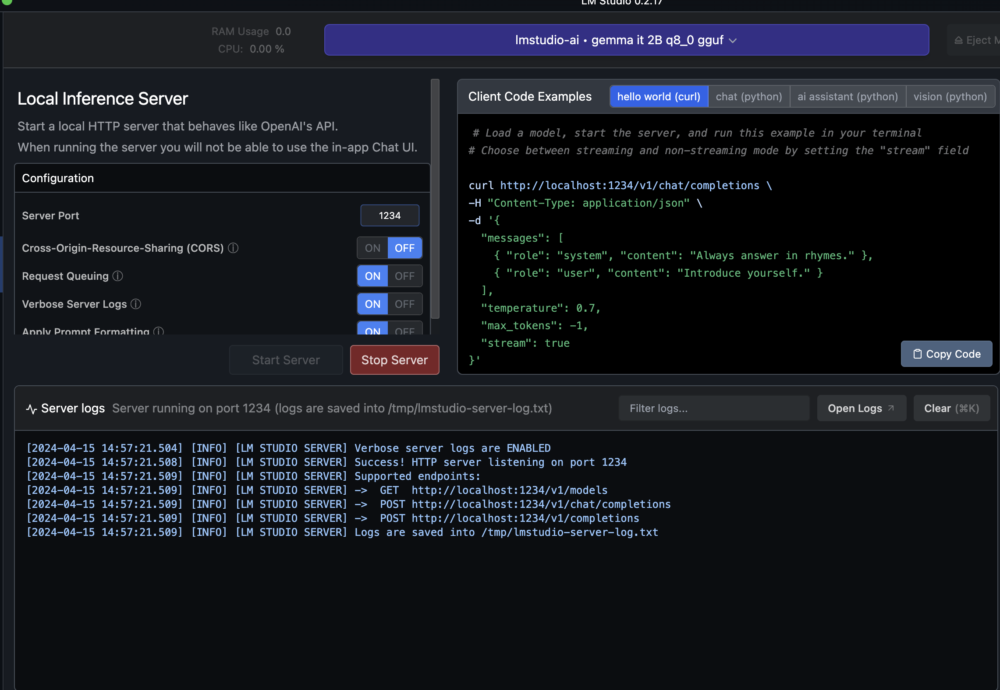

# AI Assistant APP


[](./LICENSE)

This project is an API built using **Java, Java Spring, Langchain4j and LM Studio.**

The app was developed for my [Youtube Tutorial](https://www.youtube.com/live/Vo7OnKULYUg?si=xkKK2eVBFQNJSih4), to demonstrate how to create a simple AI Assistant using RAG technique.

## Table of Contents

- [Installation](#installation)
- [Configuration](#configuration)
- [Usage](#usage)
- [API Endpoints](#api-endpoints)
- [Contributing](#contributing)

## Installation

1. Clone the repository:

```bash
git clone https://github.com/Fernanda-Kipper/ai-assistant-java
```

2. Install dependencies with Maven

## Usage

1. Start the application with Maven
2. The API will be accessible at http://localhost:8080
3. Install [LM Studio](https://lmstudio.ai/)
4. Download model Google's Gemma 2B Instruct
5. Start LM Server



## API Endpoints
The API provides the following endpoints:

**GET USERS**
```markdown
POST /api/chat - Retrieve a list of all users.
```
```json
{
  "message": "List 4 movies of the catalog that have Category Romance"
}
```
```json
{
  "response": "The movies that have Category Romance are: - La La Land - Titanic"
}
```

## RAG Knowledge Base
The Knowledge base used for retrieve context to RAG technique is the movies.txt located inside `src/main/resources` path

```txt
Movie Catalog
---

Movie: The Godfather
Year: 1972
Director: Francis Ford Coppola
Actors: Marlon Brando, Al Pacino, James Caan
Category: Action
Synopsis: The saga of the Corleone family in the Italian mafia of New York.
---

Movie: Fight Club
Year: 1999
Director: David Fincher
Actors: Brad Pitt, Edward Norton, Helena Bonham Carter
Category: Action
Synopsis: A disillusioned white-collar worker forms an underground fight club.
---

Movie: Forrest Gump
Year: 1994
Director: Robert Zemeckis
Actors: Tom Hanks, Robin Wright, Gary Sinise
Category: Comedy
Synopsis: The story of a man with low IQ who witnessed or influenced significant events of the 20th century in America, maintaining hope and love for his childhood passion, Jenny.
---

Movie: Titanic
Year: 1997
Director: James Cameron
Actors: Leonardo DiCaprio, Kate Winslet, Billy Zane
Category: Romance
Synopsis: A poor artist and a rich young woman meet and fall in love on the fateful voyage of the RMS Titanic.
---

Movie: La La Land
Year: 2016
Director: Damien Chazelle
Actors: Ryan Gosling, Emma Stone, John Legend
Category: Romance
Synopsis: A jazz musician and an aspiring actress fall in love while pursuing their dreams in a city known for crushing hopes and breaking hearts.
---

```

## Contributing

Contributions are welcome! If you find any issues or have suggestions for improvements, please open an issue or submit a pull request to the repository.

When contributing to this project, please follow the existing code style, [commit conventions](https://www.conventionalcommits.org/en/v1.0.0/), and submit your changes in a separate branch.


